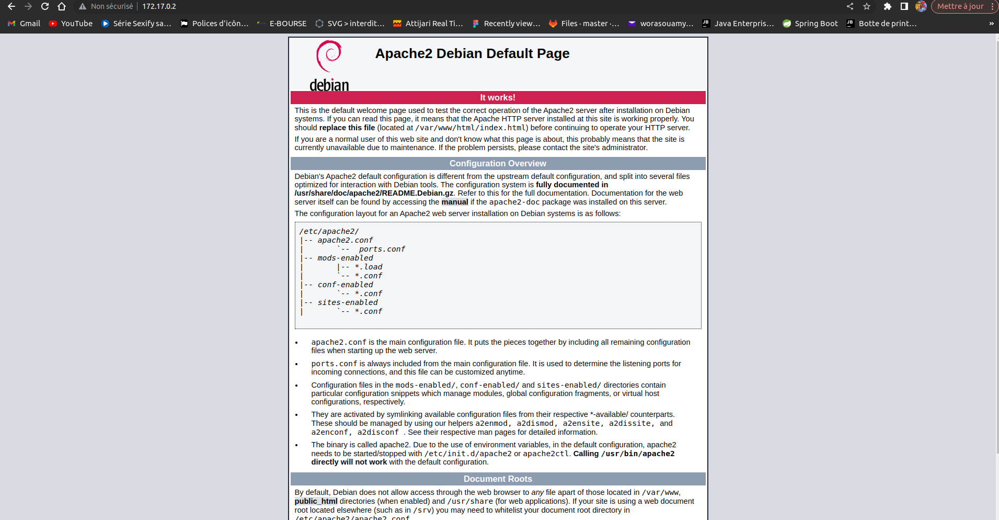
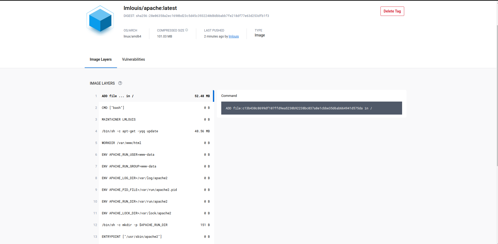

# Docker 
create image  => run container 
----
* OS : CentOS
* Docker
  
## Installer Docker  sur CentOS

source : click sur => [Documentation Docker](https://docs.docker.com/engine/install/centos/)

### créer un ripository : 

```
sudo yum install -y yum-utils
sudo yum-config-manager \
    --add-repo \
    https://download.docker.com/linux/centos/docker-ce.repo
```

### Installer Docker Engine 

lastes version 
```
sudo yum install docker-ce docker-ce-cli containerd.io docker-compose-plugin
```


demarrer docker 
```
sudo systemctl start docker
```

vérifier que docker Engine fonctionne 
```
sudo docker run hello-world
```
`docker run [image]` construit un `container` instance de l'image.
instance d'une image = container 

version docker 
```
docker -v 
```
lister les containers  en cours d'exécuution 
```
docker ps 

CONTAINER ID   IMAGE     COMMAND   CREATED   STATUS    PORTS     NAMES

```

lister tous les containers  
```
docker ps -a 
```

Importer un image 
```
docker  pull [image][: version]
```

lister les images
```
docker images
```
construir le container d'une version spécifique d'une image 
```
docker run [image][:version]
```

lancer un container en arrière plan 
image 
```
docker run -d [image][:version]
```
demarrer un container 
```
docker start  [container][:version]
```
stopper un container 
```
docker stop  [container][:version]
```

le port de localhost doit mapper sur celui du container 
```
docker -p [port_externe][:port_interne]
```
exmple : docker run -d -p 8080:80 nginx

supprimer une image
```
docker rmi [image]
```
supprimer un container 
```
docker rm [container]
```

## Exécuter de 3 manières un container 

1 . avec `docker run`
```
docker run -d --name nom_container [image] [commande]
```
2 . avec `docker exec`
```
sudo docker exec -it [id_continer] [commande]

```
3 . avec `docker attache`
```
docker run -d --name nom_container [image] [commande]
docker attach nom_container
```


## Créer une image peronaliser

$ `mkdir -p docker/Apache/`

$ `cd docker/Apache/`

$ `nano Dockerfile`

```
FROM debian:latest
MAINTAINER LMLOUIS
RUN apt-get -yqq update && apt-get install -yqq apache2
WORKDIR /var/www/html
ENV APACHE_RUN_USER www-data
ENV APACHE_RUN_GROUP www-data
ENV APACHE_LOG_DIR /var/log/apache2
ENV APACHE_PID_FILE /var/run/apache2.pid
ENV APACHE_RUN_DIR /var/run/apache2
ENV APACHE_LOCK_DIR /var/lock/apache2
RUN mkdir -p $APACHE_RUN_DIR $APACHE_LOCK_DIR $APACHE_LOG_DIR
ENTRYPOINT [ "/usr/sbin/apache2" ]
CMD ["-D", "FOREGROUND"]
EXPOSE 80
```

$ `docker build -t="lmlouis/apache"  .`

$ `docker run -d --name=Cweb -p 80 lmlouis/apache `

ou ss
$ `docker run -d --name=Cweb-localhost -p 8080:80 lmlouis/apache `

[host_conttainer]:[port]
http://172.17.0.2:80/


adresse ip du container : 
$ `docker inspect [id_container]`


exporter l'imag dans docker hub 

$ `docker push lmlouis/apache`



